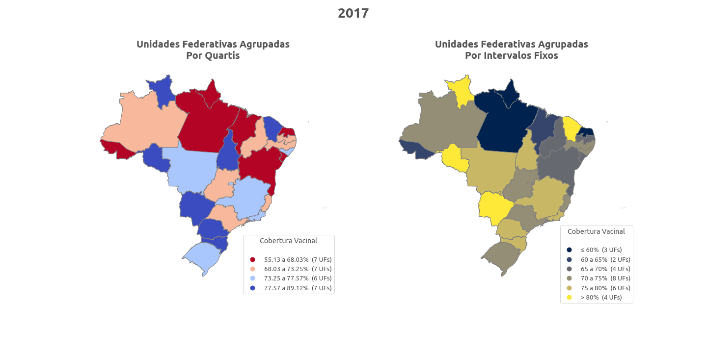

Quer ir direto ao caderno principal da análise? Clique [aqui](https://github.com/mumaral/cobertura-vacinal-estados-brasil/blob/main/notebooks/3_-_analise_e_conclusoes.ipynb).

# Introdução

Inspirado pela temática e pelas visualizações de dados do artigo [*Prioridade na vacinação negligencia a geografia da Covid-19 em São Paulo*](http://www.labcidade.fau.usp.br/prioridade-na-vacinacao-negligencia-a-geografia-da-covid-19-em-sao-paulo/), do labcidade associado à FAU-USP, resolvi explorar a seguinte questão: **a distribuição geográfica de vacinações no Brasil apresentaria algum padrão de desigualdade regional recorrente?** 

# Estrutura

[Caderno 1](./notebooks/1_-_datasus_tabnet_downloader.ipynb): script para fazer download automático dos dados, direto do site do [Tabnet](http://tabnet.datasus.gov.br/) / DataSus

[Caderno 2](./notebooks/2_-_preparacao_dos_dados.ipynb): exploração inicial, limpeza, seleção e preparação dos dados. Para mais informações sobre os dados, veja este caderno.

[Caderno 3](https://github.com/mumaral/cobertura-vacinal-estados-brasil/blob/main/notebooks/3_-_analise_e_conclusoes.ipynb): a parte principal, que contém as análises e conclusões.

# Conclusões e Próximos Passos

A conclusão com base nos dados e na forma como foram analisados é que existe uma clara desigualdade recorrente entre os anos de 2017 e 2020 entre as unidades federativas brasileiras. Enquanto alguns estados estiveram classificados no pior grupo nos quatro anos, outros se mantiveram no topo. 

Por isso, pretendo extender a análise para incluir dados de vacinação contra a covid-19, a fim de verificar se o padrão se repete também nestes dados.

